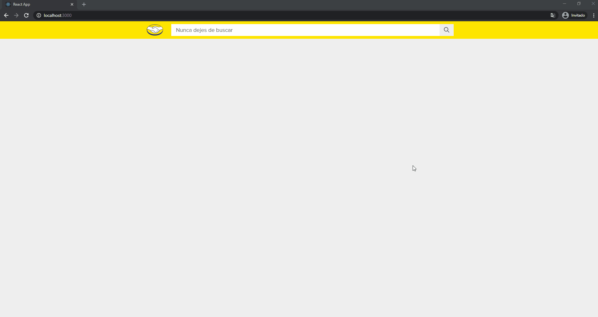

# Mercado Libre Challenge Front End

## ✏ Descripción

Web App creada para el challenge front end de Mercado Libre. El proyecto consta de un cliente hecho en React que muestra los resultados de las busquedas y el detalle de los productos consultando una API interna hecha en con Express que consulta la API de Mercado Libre. 



## ➕ Dependencias

- [node.js 14.16 o superior](https://nodejs.org/es/)

## 🔧 Instalación

Una vez clonado el repositorio se debera ejecutar la API y el cliente.

**API**
```
cd api
npm i
npm start
```

**Cliente**
```
cd client
npm i
npm start
```

⚡ Hecho por [Santi Cuiñas](https://github.com/SantiCuinas)